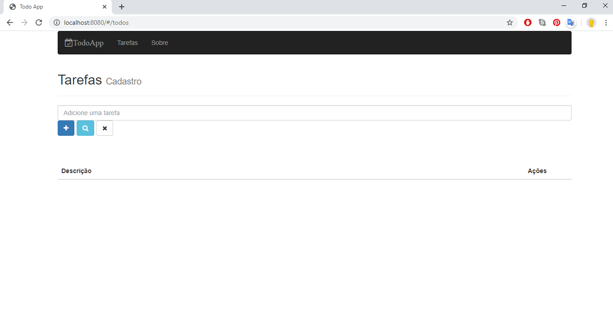

# Todo App



Foi criado um aplicativo de lista de tarefas no curso de React e Redux.

Ele permite criar uma lista de tarefas, marcá-las como feitas ou excluí-las.

## Pré-requisitos

- NPM

## Instalação

```sh
npm install
```

## Executar o app

```sh
npm run dev
```

Para visualizar acesse http://localhost:8080 em seu navegador.

## Fazer o build do app

```sh
npm run production
```
Este comando vai gerar a versão final do seu app na pasta `public` e você pode publicar ela em um servidor.